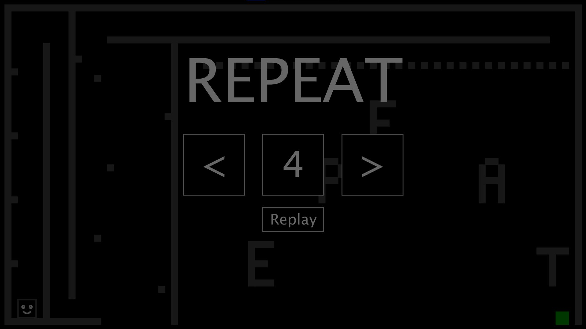
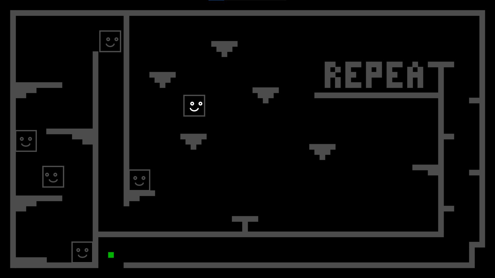

# Repeat-game

This platformer has advanced game mechanics: an exact clone of you borns every 3 seconds and does the exact same thing which you did, but shifted by 3 seconds.

For example, if at the start of the game, you wait for 2.5 seconds and then jump, during your fall, the next clone borns under you so you can jump higher from the top of your clone.
3 seconds later, the first clone jumps to the top of the second clone just as you did earlier.

It is important to not interrupt the movement of your clones since 3 of your clones have to reach the goal.

I also programmed a menu for level selection, all the buttons are coded from scratch.
There is also a replay function: by clicking on the replay button, an example play starts automatically showing a successful run (these runs are hard-coded in the Java source code).

You can try this game from your browser [here](https://www.openprocessing.org/sketch/807528) (ignore the warnings and everything, it is secure, just click on the game and you can continue playing it full screen).

A few game frames from the second level:

